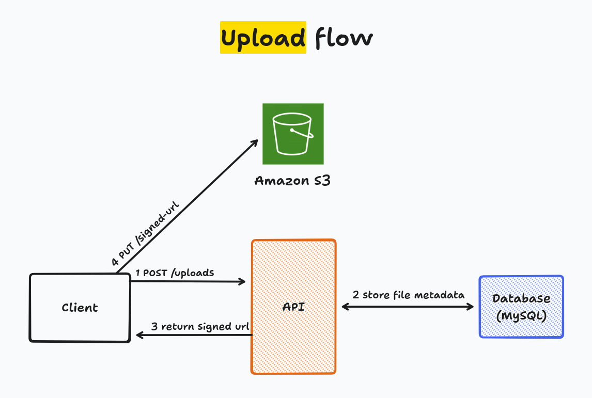
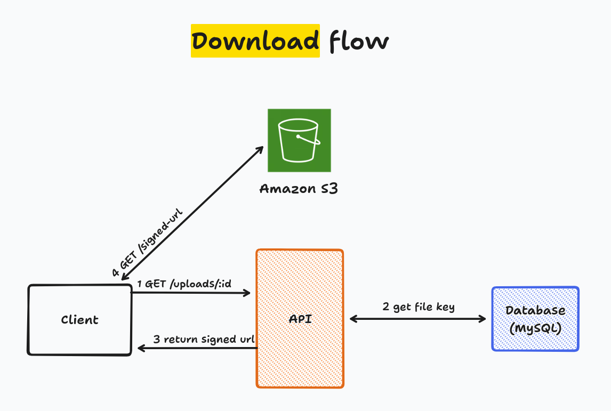

# Rabbit Hole

Rabbit Hole is a weekend side project that reimplements the core idea behind [WeTransfer](https://wetransfer.com/): let someone upload a file and share a link so anyone else can download it. It exists primarily as a hands-on exercise in backend engineering, focused on AWS (S3), MySQL and Prisma ORM, built with a layered architecture inspired by Clean Architecture and Domain-Driven Design.

## Table of Contents

- [Rabbit Hole](#rabbit-hole)
  - [Table of Contents](#table-of-contents)
  - [About the Project](#about-the-project)
  - [Tech Stack](#tech-stack)
    - [Request Flow: Uploading and Downloading a File](#request-flow-uploading-and-downloading-a-file)
  - [Engineering](#engineering)
    - [Functional Requirements](#functional-requirements)
    - [Non-Functional Requirements](#non-functional-requirements)
    - [Scale Assumptions and Capacity Estimates](#scale-assumptions-and-capacity-estimates)
    - [Business Rules](#business-rules)
  - [Getting Started](#getting-started)
    - [Prerequisites](#prerequisites)
    - [Installation](#installation)
    - [Running Locally](#running-locally)
    - [Running Tests](#running-tests)
  - [Roadmap](#roadmap)
  - [License](#license)

## About the Project

Rabbit Hole is not meant to compete with WeTransfer; it is a controlled scope to practice designing a backend service the way a production system would be designed: a documented domain, explicit boundaries between business logic and infrastructure, and files that never touch the API server's memory or disk.

## Tech Stack

| Concern          | Choice                                                    |
| ---------------- | --------------------------------------------------------- |
| Language         | TypeScript                                                |
| API framework    | NestJS                                                    |
| Database         | MySQL 8.4                                                 |
| ORM              | Prisma ORM (with the MariaDB driver adapter)              |
| Authentication   | Better Auth (email and password, admin plugin)            |
| Password hashing | Argon2 (`@node-rs/argon2`)                                |
| Object storage   | AWS S3, or any S3-compatible service, via pre-signed URLs |
| Input validation | Zod                                                       |
| Monorepo tooling | Turborepo, npm workspaces                                 |
| Testing          | Jest                                                      |
| Planned frontend | Next.js                                                   |

### Request Flow: Uploading and Downloading a File

The API never receives or serves file bytes. It only issues short-lived, pre-signed URLs; the actual transfer of bytes happens directly between the client and the object storage service. This keeps the API stateless with respect to file content and avoids bottlenecking uploads/downloads through a single process.

Uploading a file:



Downloading a file:



## Engineering

### Functional Requirements

1. **Upload a file**: given a file selected by an authenticated user => issue a pre-signed URL and let the bytes go straight from the client to object storage.
2. **Download a file**: given a file's public id => issue a pre-signed URL and let the bytes go straight from object storage to the client, authenticated or not.

Supporting requirements:

- Users must be able to browse, manage and share the files they uploaded through a web interface.
- Uploading requires an authenticated user; downloading a shared file does not — sharing only works if the recipient doesn't need an account.

### Non-Functional Requirements

- Business logic must be services-agnostic.
- File bytes must never be proxied through the API process; uploads and downloads must flow directly between the client and object storage.
- The application must fail fast at startup if required environment variables are missing or invalid.
- The object storage integration must be provider-agnostic, targeting any S3-compatible endpoint rather than being hard-coded to AWS.
- Pre-signed URLs must have a short expiration window to limit exposure if a link is leaked or shared beyond its intended recipient; the current implementation expires them after 10 minutes.
- A single pre-signed upload is bound to S3's 5 GB limit for a single `PUT` request, since multipart upload is not implemented.

### Scale Assumptions and Capacity Estimates

Rabbit Hole doesn't run under real production load, but the central architectural decision — the API only ever issues pre-signed URLs, it never touches file bytes — was made as if it had to. The estimates below make that reasoning concrete: they exist to show _why_ offloading the data path to object storage is what keeps this design viable, not just to fill out a template.

**Assumptions**

- 1,000,000 uploads per day
- Average file size: 25 MB
- Downloads-to-uploads ratio: 4:1 (a shared file is opened by ~4 recipients on average)
- Capacity planning horizon: 5 years
- A file metadata record (id, name, key, contentType, ownerId, createdAt) is ~300 bytes

**Estimates**

- Write operations (upload-URL requests): `1,000,000 / 24 / 60 / 60 ≈` **11.6 RPS**
- Read operations (download-URL requests), 4:1 ratio: `11.6 * 4 ≈` **46.3 RPS**
- Records stored over 5 years: `1,000,000 * 365 * 5 =` **1.825 billion rows**
- Database size, metadata only: `1.825 billion * 300 bytes ≈` **547.5 GB**
- Object storage volume over 5 years: `1,000,000 * 25 MB * 365 * 5 =` **45,625 TB (≈ 45.6 PB)**
- API throughput avoided by not proxying bytes: `25 TB/day / 86,400s ≈` **289 MB/s (≈ 2.3 Gbps)** sustained, on average traffic alone

The gap between the last two numbers is the entire argument for the architecture. 45.6 PB of file data flows directly between clients and object storage over that horizon, while the database the API actually queries on every request stays two orders of magnitude smaller, at ~550 GB of pure metadata — and that metadata table, not the file volume, is what the API's own scaling story has to account for. Had the API proxied file bytes instead of issuing pre-signed URLs, a single instance would need to sustain multi-gigabit throughput just for average traffic, with no burst headroom, turning a stateless, horizontally scalable service into a bandwidth bottleneck tied to disk and NIC capacity.

### Business Rules

- A file record always has an owner; there is no concept of an anonymous upload.
- The object storage key for a file must guarantee uniqueness even when two users upload files with the same name.
- Downloading a file only requires knowing its id; the API does not currently restrict downloads to the file's owner, mirroring the link-sharing model of the product that inspired this one.
- A file's declared content type must match a `type/subtype` pattern before an upload URL is issued.

## Getting Started

### Prerequisites

- Node.js 18 or newer
- npm 11 or newer
- Docker, to run the local MySQL instance
- An AWS S3 bucket, or credentials for any S3-compatible service (for example MinIO or Cloudflare R2)

### Installation

From the repository root:

```bash
npm install
```

### Running Locally

```bash
# start the local MySQL instance
cd apps/api
docker compose up -d

# apply database migrations
npx prisma migrate dev

# start the API in watch mode
npm run start:dev
```

Alternatively, from the repository root, `npm run dev` starts every app registered with Turborepo.

### Running Tests

```bash
cd apps/api
npm run test
```

## Roadmap

- [x] Email and password authentication
- [x] Pre-signed upload URL generation
- [x] Pre-signed download URL generation
- [ ] SST
- [ ] Files collections
- [ ] Notifications
- [ ] Password protected shares

## License

MIT by [Wolney Oliveira](https://wolney.dev)
